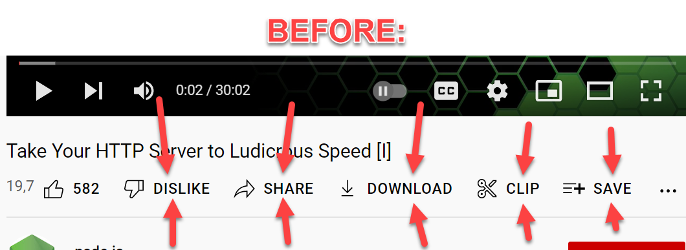
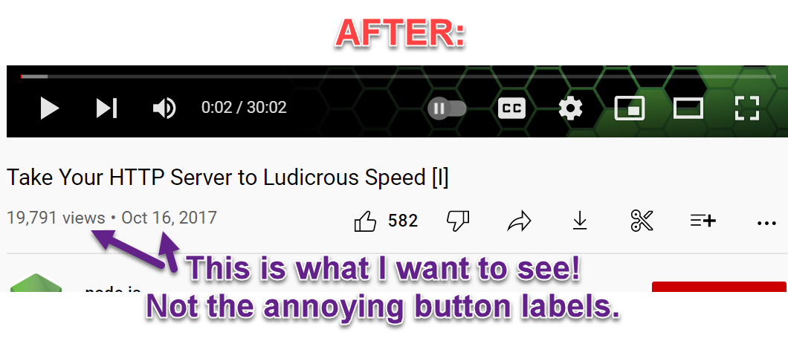
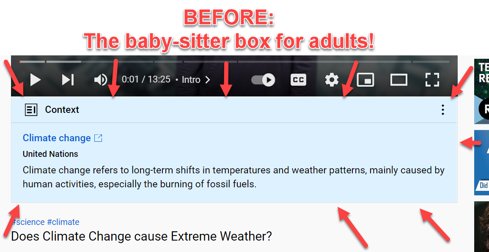
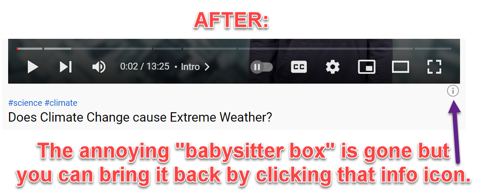

# YT Nuisance Remover

This simple browser extension/add-on is designed to ***automatically remove annoying nuisance/garbage/rubbish from under the videos on YouTube***. 

Tested in Chrome but should work in other browsers like Firefox just as well. 

Here's what it does: 

## 1) Remove annoying/useless button labels:

--- 

## 2) Remove annoying baby-sitter boxes:

Not only are those 'babysitter boxes' annoying because they try to push someone else's opinion (or propaganda) over the topic discussed in the video and don't offer a way to opt-out of that ridiculous babysitter nonsense (trying to 'babysit' me as an adult).

Those 'babysitter boxes' are also annoying because they push important content (like video title, view count and the buttons) down! Thus, you might not even see the video title on a laptop because of that nuisance. You might have to scroll down to see the video title and the view count. No, thank you!

This extension removes that nuisance like so: 

Note: The info icon under the lower right corner of the video only appears if YouTube wants to show a 'babysitter box'. And even when that info icon appears, it does NOT push the other content down! 

So, that info icon is *deliberately tiny* and tucked away in the corner because it's designed *to be used with a mouse* on a desktop/laptop (which is the only place the Chrome browser allows you to install extensions like this one). And while Firefox allows installing extensions on a smartphone or tablet, I haven't tested it there. 

